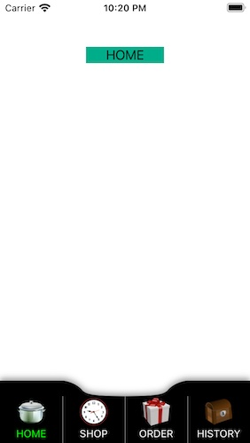
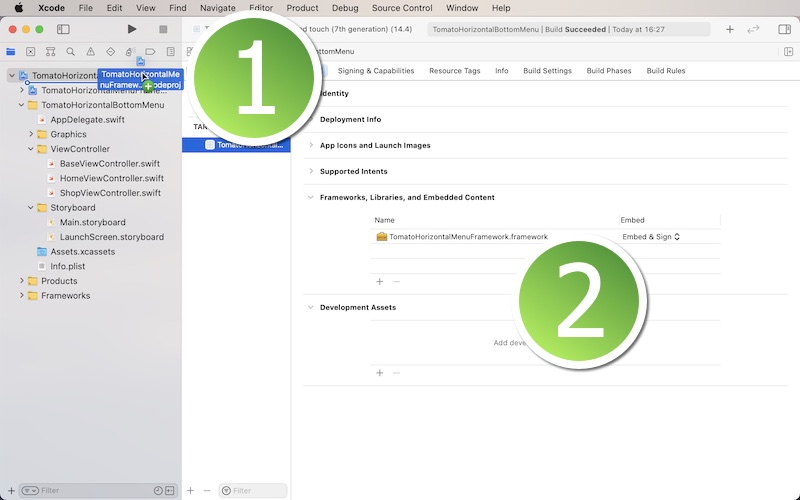
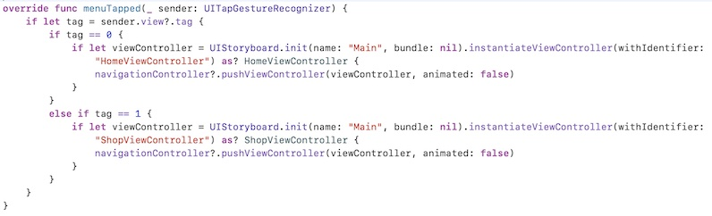

# TomatoHorizontalBottomMenu Framework

<h2>Development and compatibility</h2>

Development platform: iOS 
Language: Swift 
UI framework: UIKit 
Compatibility: iOS 11 or greater 

<h2>Description</h2>

TomatoHorizontalBottomMenu Framework lets you create a horizontal, scrollable menu at the bottom of the screen.  Each sub-menu corresponds to a specific view controller.  Since the entire menu content is scrollable, you can add as many sub-menus as you want to the horizontal menu.  The following is a list of features.

<ol>
<li>Add five, six or as many as sub-menus as you want to the horizontal menu.</li>
<li>Use an image to characterize each sub-menu.</li>
<li>Use two label colors, normal and highlight.  The latter applies to the view controller that is currently selected.</li>
<li>Have options of having or not having a cave-in area at the top.</li>
<li>Adjust the cave-in width.</li>
<li>Have options of having or not having a vertical line between sub-menus.</li>
</ol>

<h2>Installation</h2>

1. In order to use this framework, download the sample project.  You will find the folder titled **TomatoFramework**.  Locate the Xcode file inside.  And put this Xcode file in your Xcode project.  Select your target and make sure you have **TomatoHorizontalMenuFramework.framework** under General > Framworks, Libraries, and Embeded Content as shown below.

2. Create a sub-class of **UIViewController**.  Name it BasicViewController, BaseViewController, RootViewController or whatever you want such that all child view controllers can be based on.  For now, let us call this base view controller **BasicViewController**.  Import **TomatoHorizontalMenuFramework** to the view controller.

3. In the base view controller, set the class to **TomatoHorizontalViewController**.  Create a function to set up the menu.  Let us call this function **setup(index: Int)**.  Also create an **override** function named **menuTapped**.

4. In the setup function, create an array of menu models with **TomatoHorizontalMenuModel**.  This struct takes three properties: name (String), imageName (String), menuIndex (Int).  The **name** property is the name of a tappable sub-menu.  And each of them corresponds to a specific view controller through the menuTapped function.  The **imageName*** property refers to the name of the image used to characterize each sub-menu.  And the index property determines the order of appearance.  It also tells the app which view controller it should access.

5. Call **tomatoSetup(index: index)** in the setup(index: Int) function of the base view controller.

6. Use the menuTapped function to read sender view's tag to direct the app to a specific view controller.  The following is an example.

7. In each view controller to which the app is directed to, change the class to BasicViewController.  In its **viewDidLoad** method, call setup(index: number), where 'number' is an Int type value of a menu model from No. 4.

<h2>Variables</h2>

<li>menuHasCaveIn: Set it to true to have a cave-in area at the center.</li>
<li>menuCaveInColor: It's the color of the cave-in area.</li>
<li>menuCaveInWidth: It's the cave-in width.  It must greater or equal to 80.0 and smaller or equal to 280.0.</li>
<li>menuFillColor: It's the background color of the entire horizontal menu.</li>
<li>menuWidth: It's the width of each sub-menu.</li>
<li>menuHeight: It's the height of each sub-menu.</li>
<li>menuHasShadow: Set it to true to have a shadow around the menu.</li>
<li>menuShadowColor: It's the color of the shadow around the menu.</li>
<li>menuShadowRadius: It's the extent of the shadow around the menu.</li>
<li>menuShadowOpacity: It's the opacity level of the shadow around the menu.</li>
<li>menuHasLine: Set it to true to have vertical lines between two sub-menus.</li>
<li>lineColor: It's the line color.</li>
<li>lineWeight: It's the line width between two sub-menus.  It must be greater or equal to 0.5 and smaller than or equal to 1.0.</li>
<li>imageSize: It's the size (width and height) of the image characterizing each sub-menu.</li>
<li>labelTextSize: It's the text size of the menu label.</li>
<li>labelTop: It's the space between the label and the the bottom-edge of the sub-menu.</li>
<li>labelHeight: It's the label height.</li>
<li>labelNormalColor: It's the color of the name label for those that are not selected.</li>
<li>labelHighlightColor: It's the color of the name label for the view controller that is currently selected.</li>
